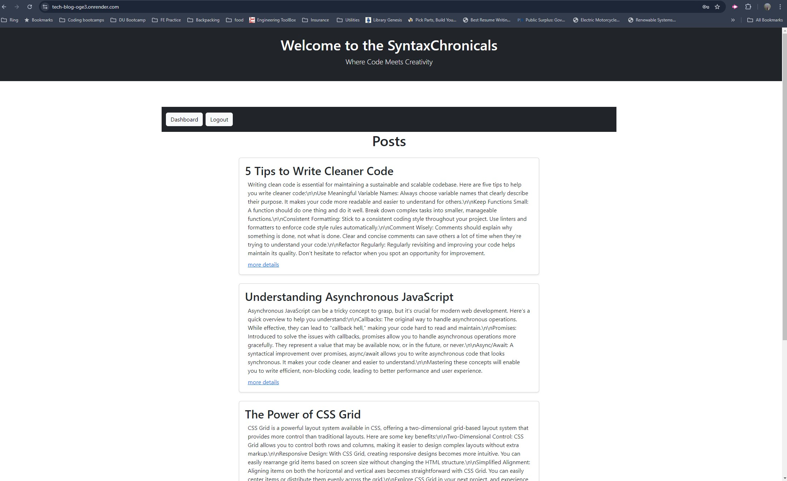

# Syntax Chronicals

## Description 
Syntax Chronicals is a full-stack blog application that allows users to create, view, and manage blog posts. The application is built with Node.js, Express, Sequelize, and Handlebars, and uses PostgreSQL as the database. Users can sign up, log in, and manage their posts through an intuitive dashboard.

## Table of Contents
- [Installation](#installation)
- [Usage](#usage)
- [URL](#url)
- [Credits](#credits)
- [License](#license)
- [How to Contribute](#how-to-contribute)
- [Questions](#questions)

## Installation
Clone the repository, https://github.com/Taboada-B/Tech_Blog.git  . Set up .env in the same format of .env.example. Next run these commands from the root: npm install | psql -U postgres | Enter you personal password | \i db/schema.sql; | \q | node models/index.js | node seeds/seeds.js | node server.js  These commands should install dependencies, establish the database, establish the models, seed data, and start the server. 

## Usage
follow the link in the terminal and browse the website.

## URL
Deployed URL: https://tech-blog-oge3.onrender.com/login

## Credits
Paul Chaplin created the reset.css

## License

This project is licensed under the MIT 
- see the following link for details: [MIT License](https://opensource.org/licenses/MIT)

## How to Contribute
Contributions are welcome! Please follow these steps to contribute:

1. Fork the repository.
2. Create a new feature branch (git checkout -b feature-branch).
3. Commit your changes (git commit -m 'Add some feature').
4. Push to the branch (git push origin feature-branch).
5. Create a new Pull Request.

## Questions
My github profile is: https://github.com/Taboada-B

My email is: b.taboada123@gmail.com
